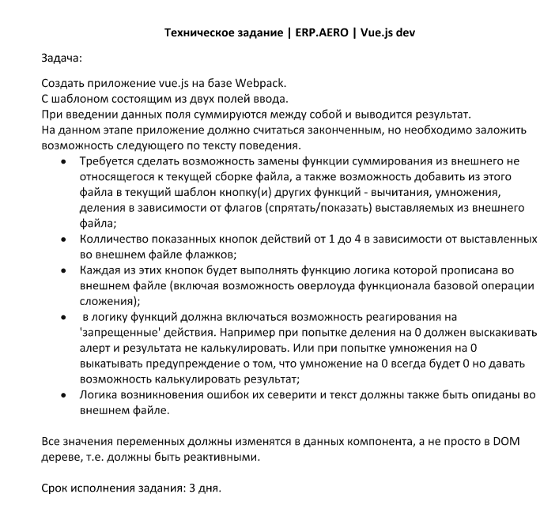

# ERP.AERO Тестовое задание

# Запуск

Запустите эту команду находясь в папке с проектом в командной строке 

```npm install && npm run dev```

Сервак запуститься на 

```http://localhost:8080```

# Суть задания 

